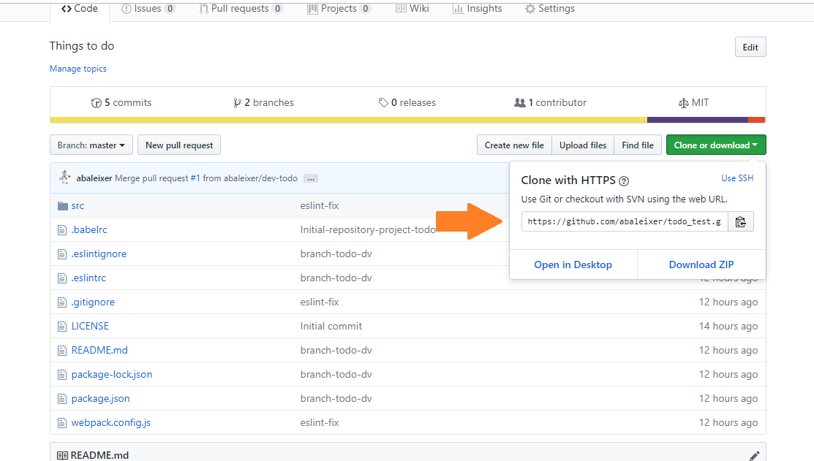
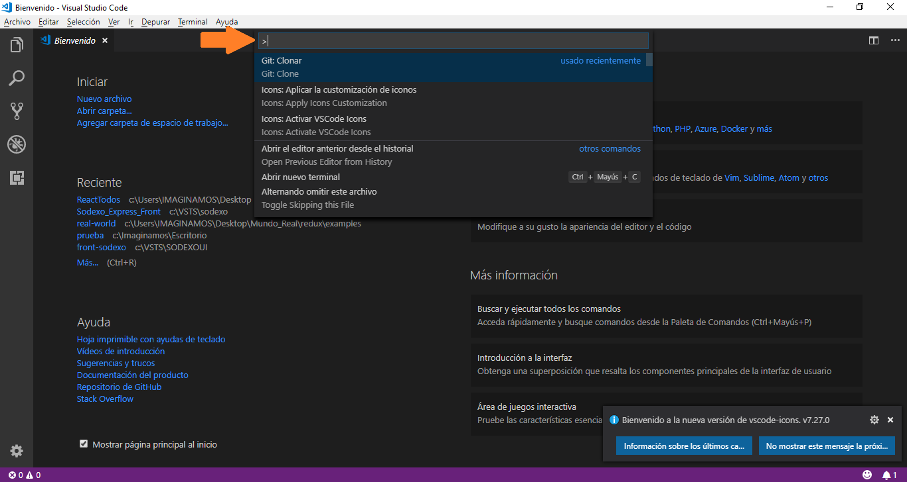
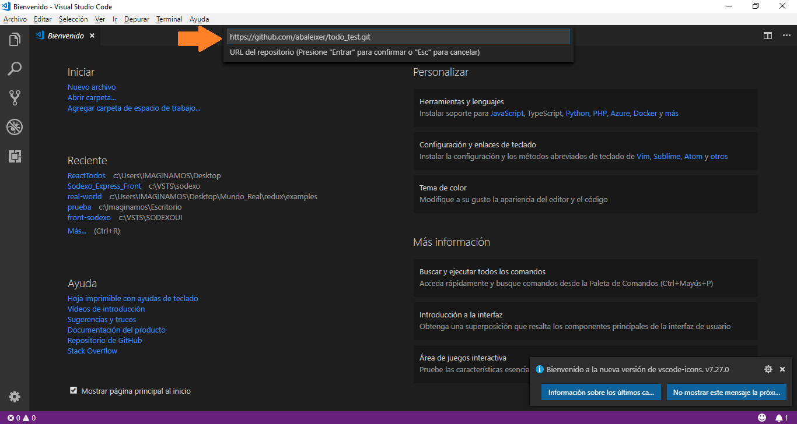
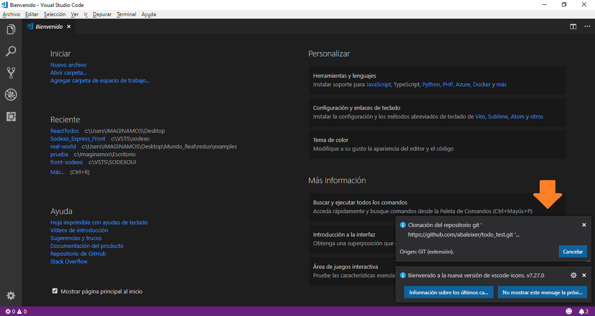
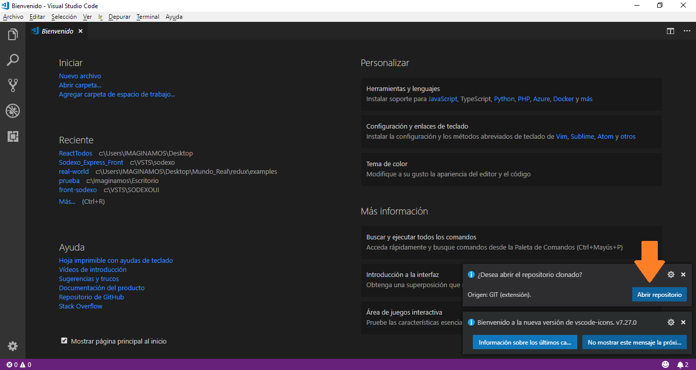
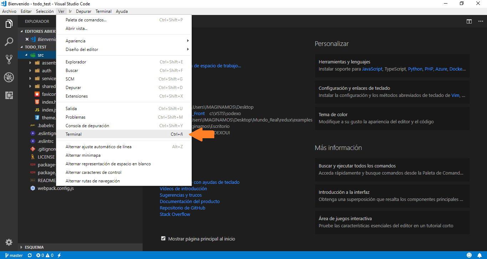
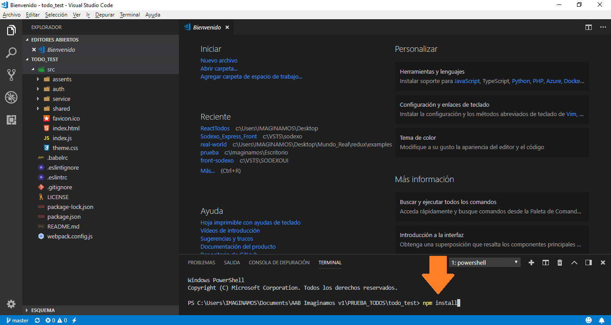
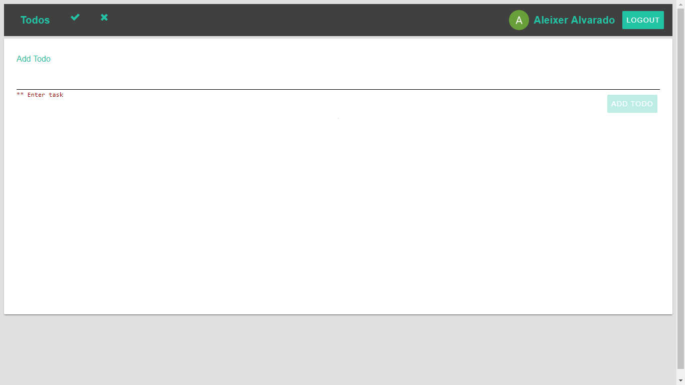
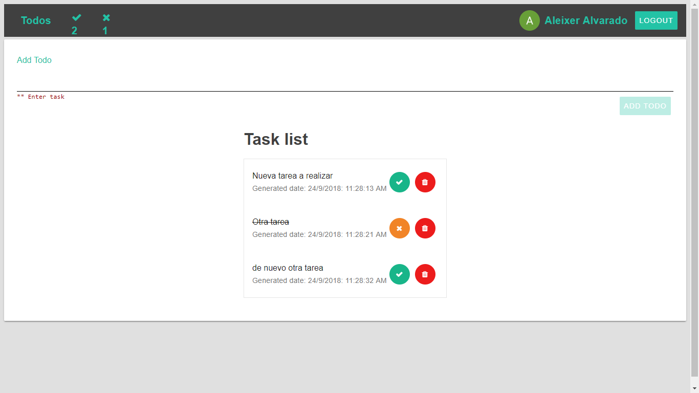

# **React con Webpack**

---
---
## **Reto REACT/REDUX propuesto (Agosto 22, 2018) @Rigo**

**La prueba consiste en construir un Todo List con los siguientes requerimientos:**

 - Listar todos los items
 - Añadir un item
 - Borrar un item
 - Una página de Login que proteja la vista anterior, esto significa que solo puede interactuar si ha ingresado. Para ingresar el usuario debe escribir su email y contraseña (ambos campos validados), no necesita tener un backend, únicamente con la persistencia de Redux.

|Qué se valora en la prueba|Qué NO hacer en la prueba|
|--|--|
| 1. Usar CSS in JS, por ejemplo como styled-components, JSS, etc...  2. Un UI/UX agradable 3. Usar eslint, standard y/o prettier 4. Escribir pruebas unitarias y/o de comportamiento|1. NO usar ningún boilerplate ni starter tales como create-react-app, react starter kit, react boilerplate, etc... 2. NO clonar alguna prueba de otro participante
|

**Crear un repositorio en GitHub y enviar URL a: @rigo**

---
---

## **Configuración inicial versión en contrucción**
> 1. Crear carpeta projecto
> 2.  Inicializar la aplicacion con `npm init`
>     - agregar los datos que pide; al final creara el archivo `package.json`
> 3. Instalar la libreria de **React** con los comandos  
>     - `npm i react react-dom`
> 4. Instalar **Webpack** con los comandos
>     - `npm i --save-dev webpack webpack-dev-server webpack-cli`
> 5. Instalar **babel** con los comandos
>     - `npm i --save-dev babel-core babel-loader babel-preset-env babel-preset-react html-webpack-plugin` **NOTA:** para corregir el error de la versión podemos instalar este comando; para bajar la versión del *loader* `npm install -D babel-loader@7 babel-core babel-preset-env webpack`
> 6. Crear el archivo `webpack.config.js` con la configuración

```
const path = require('path');
const HtmlWebpackPlugin = require('html-webpack-plugin');
module.exports = {
    entry: __dirname + '/src/index.js',
    output: {
        path: path.join(__dirname, '/dist'),
        filename: 'index_bundle.js'
    },
    module: {
        rules:[{
            test: /\.js$/,
            exclude: /node_modules/,
            use:{
                loader:'babel-loader'
            }
        }]
    },
    plugins:[
        new HtmlWebpackPlugin({
            template: './src/index.html'
        })
    ]
}
```
> 7. Crear la carpeta `src` donde agregamos los archivos principales `index.js` y `index.html` estos archivos pueden ir en la carpeta ***public*** 
> 8. Verificar la configuracion del archivo resultante `package.json` 
```
{
  "name": "todos",
  "version": "1.0.0",
  "description": "Lista de tareas React Webpack",
  "main": "index.js",
  "scripts": {
    "start": "webpack-dev-server --mode development --open --hot",
    "build": "webpack --mode production",
    "test": "echo \"Error: no test specified\" && exit 1"
  },
  "author": "Aleixer Alvarado Bernal",
  "license": "MIT",
  "dependencies": {
    "react": "^16.5.1",
    "react-dom": "^16.5.1"
  },
  "devDependencies": {
    "babel-core": "^6.26.3",
    "babel-loader": "^7.1.5",
    "babel-preset-env": "^1.7.0",
    "babel-preset-react": "^6.24.1",
    "html-webpack-plugin": "^3.2.0",
    "webpack": "^4.19.0",
    "webpack-cli": "^3.1.0",
    "webpack-dev-server": "^3.1.8"
  }
}
```

> 9. Crear el archivo de configuración de babel en la carpeta raiz `.babelrc` con esta información

```

{
    "presets": [
        "env",
        "react"
    ]
}
```


---

> ¿Que es Babel?: según *https://platzi.com/blog/que-es-babel/* *Babel es una herramienta que nos permite transformar nuestro código JS de última generación (o con funcionalidades extras) a JS que cualquier navegador o versión de Node.js entienda.
Babel funciona mediante plugins para que le indiquemos que cosas queremos que transforme, por ejemplo con el plugin babel-plugin-transform-es2015-arrow-functions podemos decirle que transforme las arrow functions de ECMAScript 2015 a funciones normales, con babel-plugin-transform-react-jsx podemos hacer que entienda código de JSX y lo convierta a código JS normal.*

> *¿Qué es Webpack?: Según *http://www.pro-react.com/materials/appendixA/*
A lo largo de los años, el desarrollo web evolucionó de páginas con pocos recursos y JavaScript a las aplicaciones completas con JavaScript complejo y grandes árboles de dependencia (archivos que dependen de muchos otros archivos).
Para ayudar a hacer frente a esta creciente complejidad, la comunidad ideó diferentes enfoques y prácticas, tales como:
El uso de módulos en JavaScript nos permite dividir y organizar un programa en varios archivos.
Preprocesadores de JavaScript (que nos permiten usar funciones que estarán disponibles en versiones futuras de JavaScript) y compilación en JavaScript (como CoffeeScript, por ejemplo)
Pero a pesar de ser inmensamente útiles, estos avances han llevado a la necesidad de dar un paso adicional en el proceso de desarrollo: necesitamos agrupar y transformar (transpilar / compilar) estos archivos en algo que el navegador pueda comprender. Ahí es donde herramientas como Webpack son necesarias.
Webpack es un paquete de módulos: una herramienta que puede analizar la estructura de su proyecto, encontrar módulos de JavaScript y otros activos para agruparlos y empaquetarlos para el navegador.*
---
---
## **Instalación de librerías complementarias**
> 1. Con el comando siguiente instalamos la librería de rutas `npm install --save react-router-dom`
> 2. Instalar TSLint `npm install eslint --save-dev`
>          `npm install eslint-plugin-react --save-dev`
>        `npm i --sabe  babel-eslint` `npm i -D babel-eslint`
> > 1. Creamos el archivo que le informa que carpetas debe ignorar con las reglas a aplicar `.eslintignore`
> > 2. Creamos el archivo que contiene las reglas del eslint con el nombre `eslintrc`
> 3. Instalar Redux desde *https://redux.js.org/basics/usagewithreact*  `npm install --save react-redux`
> 4.        y Redux                                                   `npm install --save redux`
> 5. Instalar Firebase como servicio de API `npm install --sabe firebase`
/*
  Reglas definidas en el link: http:/./eslint.org/docs/rules/

  "off" or 0 - turn the rule off
  "warn" or 1 - turn the rule on as a warning (doesn’t affect exit code)
  "error" or 2 - turn the rule on as an error (exit code will be 1)
*/

# Clonar repositorio git
> ## 1. **Copiar Url**
>     - https://github.com/abaleixer/todo_test.git
> 
>
> ## 2. **Abrir la paleta de comandos en <i style='color:blue'>visual estudio code</i> Ingresamos `Git: Clonar`**
> 
>
> ## 3. **Insertar la `url` en el campo**
> 
>
> ## 4. **Esperamos que termine el proceso de descarga, después de selecciona la carpeta donde queremos clonar el proyecto** 
> 
>
> ## 5. **Oprimir en <i style='background: #5252fc;color: white;border: 1px solid rgba(27,31,35,0.2);    border-radius: 0.25em; font-size: 13px;'>Abrir repositorio</i>**
> 
>
> ## 6. **Abrir la terminal en `code`**
> 
>
> ## 7. **En la consola ejecutamos el comando `npm install`**
>    - Para instalar las dependencias del proyecto
> 
>
> ## 8. **Finalmente verificamos que este agregada en la raíz del proyecto la carpeta `node_modules`** 
> ## 9. **Ejecutamos el comando `npm start` para iniciar el proyecto**

---
---
# **Estructura de la aplicación** 

* [dist](#dist)  
* [node_modules](#nodemodules)
* [src](#src) 
  * [assents](#assents)
  * [auth](#auth)
    *  [<i style="color:#ffe502">addTodo.js</i>](#addtodo)
    *  [<i style="color:#ffe502">dashboard.js</i>](#dashboard)
    *  [<i style="color:#ffe502">todos.js</i>](#todos)
  * [service](#service)
      *  [<i style="color:#ffe502">firebase-config.js</i>](#firebasec)
  * [shared](#shared)
     *  [<i style="color:#ffe502">actions.js</i>](#actions)
     *  [<i style="color:#ffe502">atore.js</i>](#atore)
     *  [<i style="color:#ffe502">styles.js</i>](#styles)
     *  [<i style="color:#ffe502">task.js</i>](#task)
  * [<i style="color:#ff8300">favicon.ico</i>](#favicon)
  * [<i style="color:#ff8300">index.html</i>](#index)
  * [<i style="color:#ff8300">index.js</i>](#indexjs)
  * [<i style="color:#ff8300">theme.css</i>](#theme)
* [Z-README](#zreadme)
* [<i style="color:#ff8300">.babelrc</i>](#editorconfig)</i> 
* [<i style="color:#ff8300">.eslintignore</i>](#gitignore)</i> 
* [<i style="color:#ff8300">.eslintrc</i>](#tslint)</i> 
* [<i style="color:#ff8300">.gitignore</i>](#gitignore)</i> 
* [<i style="color:#ff8300">LICENSE</i>](#LICENSE)</i> 
* [<i style="color:#ff8300"> package-lock.json</i>](#packagelock)</i> 
* [<i style="color:#ff8300">package.json</i>](#package)</i> 
* [<i style="color:#ff830.0">README.md</i>](#sreadme)</i> 
* [<i style="color:#ff830.0">webpack.config.js</i>](#sreadme)</i> 

# Resultado final   
> ## **El resultado esperado cumple con:** 
> 1. Registrarse 
>       - Este punto se realiza mediante un proveedor de autenticación; en este caso Google usando el servicio de firebase
> 2. Agregar tareas (se usa un input validado)
> 3. Listado de tareas según se agreguen
> 4. Permite cambiar el estado de la tarea
> 5. Eliminar las tareas
> 6. Un contador superior que lleva el total de las tareas tanto por hacer como realizadas 
>
>
> ## Landing
> 
>
> ## Panel principal registrado
> 
>
> ## Ejemplo con una lista de tareas 
> 